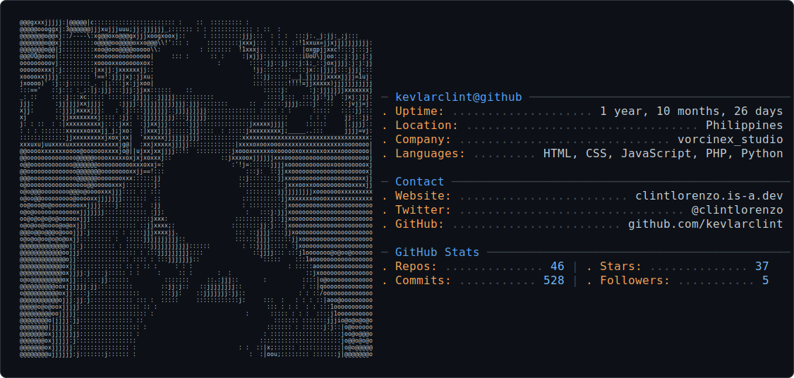

<picture>
  <source media="(prefers-color-scheme: dark)" srcset="dark_mode.svg" />
  <source media="(prefers-color-scheme: light)" srcset="light_mode.svg" />
  
</picture>

  <a href="https://github.com/kevlarclint">
    <picture>
      <source media="(prefers-color-scheme: dark)" srcset="https://neofetch-profile.vercel.app/api?username=kevlarclint&theme=github-dark">
      
    </picture>
  </a>

  
 
  

